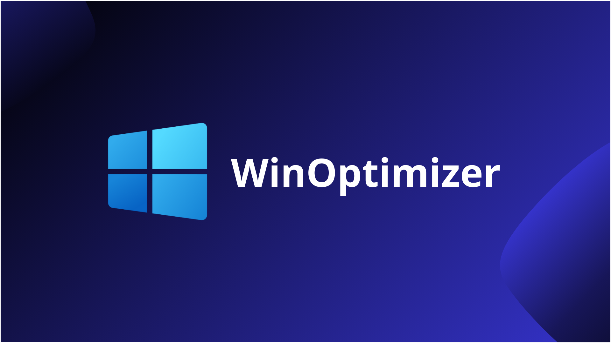

    

# 
**🌎 Sobre o projeto**

`WinOptimizer` é um pequeno projeto pessoal desenvolvido apenas por mim, **Tavin17**, onde o código executado desativa, remove ou limpa arquivos, aplicativos ou serviços que são completamente desnecessários principalmente para pessoas que jogam, diminuindo drasticamente o número de processos e o uso da sua CPU e GPU. Consequentemente garantindo uma maior estabilidade no FPS, menos InputLag e um Windows mais responsivo.

    
    
    

### 
**📋 Recursos:**

#
- **Otimizações regedit:**
    - ***+200 otimizações das mais básicas até as mais profundas! como:***
        - Desativação da XboxGameBar para reduzir o uso da CPU e GPU
        - Priorizar o máximo do seu computador para jogos
        - Otimizações mais profundas para praticamente ZERAR seu InputLag
        - Desativação de telemetria e muito mais! 

- **Desativação de Serviços:**
    - ***+80 Serviços desnecessários que ficam em segundo plano fazendo absolutamente nada apenas consumindo CPU e prejudicando sua jogabilidade! Alguns serviços:***
        - SysMain
        - Serviços Microsoft Edge
        - Serviço de Política de Diagnóstico
        - Serviços Hyper-V e muito mais!

- **Aplicação de comandos no CMD:**
    - **+15 comandos para melhorar InputLag, limpar lixo, plano de energia personalizado e mais!**  
    - Otimização de unidades
    - Comandos **FSutil**
    - Comandos **bcdedit**
    - Desinstalação completa da **XboxGameBar**
    - Limpeza de **arquivos temporários** e **cache**

### 
**⚠️ Coisas que podem parar de funcionar:**

#
- **Windows Copilot**
- **Windows Recall**
- **Conectar à uma impressora ou imprimir algo**
- **Instalar algum aplicativo da MS Store**
- **Cortana**
- **OneDrive**
- **XboxGameBar**

## 
**👨‍💻 Compatibilidade**

- **Windows 10:**
  - Todas as versões
- **Windows 11:**
  - Versões **1.0**, **1.5**, **1.8**, **2.8+**
  - Compatibilidade parcial nas versões **2.0** e **2.5**
    

## 
**🖥️ Como instalar?**

- Vá para **[Releases](https://github.com/Tavin17/WinOptimizer/releases)** e instale a versão mais recente.
- Para complementar e fazer uma otimização completa, você também pode usar:
  - **[Chris Titus Tech's Windows Utility](https://github.com/ChrisTitusTech/winutil)** (Bastante recomendado)
  - **[O&O ShutUp10++](https://www.oo-software.com/en/shutup10)**
  - **[Optimizer](https://github.com/hellzerg/optimizer)**
  
>[!WARNING]
> Crie um ponto de restauração antes de realizar qualquer otimização. Execute esse arquivo por sua conta e risco. Funções que talvez sejam necessárias para você podem ser desativadas. Caso tenha problemas, utilize um `Ponto de Restauração`.

## 
**🤝 Contribuição**

1. Faça um clone / fork do branch principal
2. Crie um novo branch no seu fork
3. Faça suas alterações
4. Faça um commit das suas mudanças depois faça um push delas
5. Solicite um Pull Request [aqui](https://github.com/Tavin17/WinOptimizer/pulls)!

## 
**Licença**

Este projeto está licenciado sob a [Creative Commons Attribution-NonCommercial-NoDerivatives 4.0 International License](LICENSE). Você pode usar e modificar o código para fins não comerciais, mas não pode redistribuí-lo ou criar trabalhos derivados.
