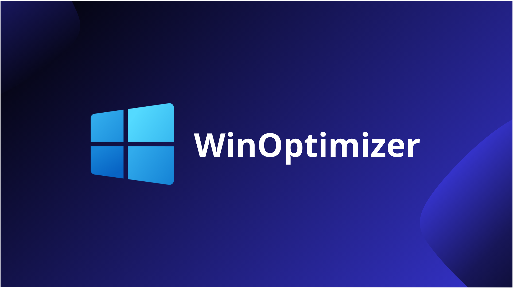

    

<h3 align="center" style="margin-bottom: 5px;"><strong>🌎 Sobre o projeto</strong></h3>

<code>WinOptimizer</code> é um pequeno projeto pessoal desenvolvido apenas por mim, <strong>Tavin17</strong>, onde o código executado desativa, remove ou limpa arquivos, aplicativos ou serviços que são completamente desnecessários principalmente para pessoas que jogam, diminuindo drasticamente o número de processos e o uso da sua CPU e GPU. Consequentemente garantindo maior estabilidade no FPS, menos InputLag e um Windows mais responsivo.

 
 

    
    
    

<h3 align="center" style="margin-bottom: 5px;"><strong>📋 Recursos</strong></h3>

<ul>

  <li><strong>Otimizações regedit:</strong>
    <ul>
      <li><em>+200 otimizações das mais básicas até as mais profundas! Como:</em></li>
      <ul>
        <li>Desativação da XboxGameBar para reduzir o uso da CPU e GPU</li>
        <li>Otimização de Rede</li>
        <li>Otimização de Energia para melhor desempenho do computador</li>
        <li>Remoção de telemetria e muito mais!</li>
      </ul>
    </ul>
  </li>

  <li><strong>Desativação de Serviços:</strong>
    <ul>
      <li><em>+80 Serviços desnecessários que ficam em segundo plano fazendo absolutamente nada apenas consumindo CPU e prejudicando sua jogabilidade! Alguns serviços:</em></li>
      <ul>
        <li>SysMain</li>
        <li>Serviços Microsoft Edge</li>
        <li>Serviço de Política de Diagnóstico</li>
        <li>Serviços Hyper-V e muito mais!</li>
      </ul>
    </ul>
  </li>

  <li><strong>Aplicação de comandos no CMD:</strong>
    <ul>
      <li><strong>+15 comandos para melhorar InputLag, limpar lixo, plano de energia personalizado e mais!</strong></li>
      <ul>
        <li>Otimização de unidades</li>
        <li>Comandos <strong>FSutil</strong></li>
        <li>Comandos <strong>bcdedit</strong></li>
        <li>Desinstalação completa da <strong>XboxGameBar</strong></li>
        <li>Limpeza de <strong>arquivos temporários</strong> e <strong>cache</strong></li>
      </ul>
    </ul>
  </li>
</ul>

<h3 align="center" style="margin-bottom: 5px;"><strong>⚠️ Coisas que podem parar de funcionar</strong></h3>

<ul>
  <li><strong>Windows Copilot</strong></li>
  <li><strong>Windows Recall</strong></li>
  <li><strong>Conectar à uma impressora ou imprimir algo</strong></li>
  <li><strong>Instalar algum aplicativo da MS Store</strong></li>
  <li><strong>Cortana</strong></li>
  <li><strong>OneDrive</strong></li>
  <li><strong>XboxGameBar</strong></li>
</ul>

<h3 align="center" style="margin-bottom: 5px;"><strong>👨‍💻 Compatibilidade</strong></h3>

  <li><strong>Windows 10:</strong>
    <ul>
      <li>Todas as versões.</li>
    </ul>
  </li>

  <li><strong>Windows 11:</strong>
    <ul>
          <li>Versões <strong>1.0</strong>, <strong>1.5</strong>, <strong>1.8</strong>, <strong>2.8+.</strong></li>
    <li>Compatibilidade parcial nas versões <strong>2.0</strong> e <strong>2.5</strong>.</li>
    </ul>
  </li>

<h3 align="center" style="margin-bottom: 5px;"><strong>🖥️ Como instalar?</strong></h3>

<ul>
  <li>Vá para <strong><a href="https://github.com/Tavin17/WinOptimizer/releases">Releases</a></strong> e faça o download da versão mais recente.</li>
  <li>Para complementar e fazer uma otimização completa, você também pode usar:
    <ul>
      <li><strong><a href="https://github.com/ChrisTitusTech/winutil">Chris Titus Tech's Windows Utility</a></strong> (Bastante recomendado)</li>
      <li><strong><a href="https://www.oo-software.com/en/shutup10">O&O ShutUp10++</a></strong></li>
      <li><strong><a href="https://github.com/hellzerg/optimizer">Optimizer</a></strong></li>
      <li><strong><a href="https://github.com/memstechtips/Winhance">Winhance</a></strong></li>
    </ul>
  </li>
</ul>

  <strong>⚠️</strong> Crie um ponto de restauração antes de realizar qualquer otimização. Execute esse arquivo por sua conta e risco. Funções que talvez sejam necessárias para você podem ser desativadas. Caso tenha problemas ou não goste do resultado, utilize um <code>Ponto de Restauração</code>.

<h3 align="center" style="margin-bottom: 5px;"><strong>🤝 Contribuições</strong></h3>

<ol>
  <li>Faça um clone / fork do branch principal</li>
  <li>Crie um novo branch no seu fork</li>
  <li>Faça suas alterações</li>
  <li>Faça um commit das suas mudanças depois faça um push delas</li>
  <li>Solicite um Pull Request <a href="https://github.com/Tavin17/WinOptimizer/pulls">aqui</a>!</li>
</ol>

<h3 align="center" style="margin-bottom: 5px;"><strong>📕 Licença</strong></h3>

Este projeto está licenciado sob a <a href="LICENSE">Creative Commons Attribution-NonCommercial-NoDerivatives 4.0 International License</a>. Você pode usar e modificar o código para fins não comerciais, mas não pode redistribuí-lo ou criar trabalhos derivados.
